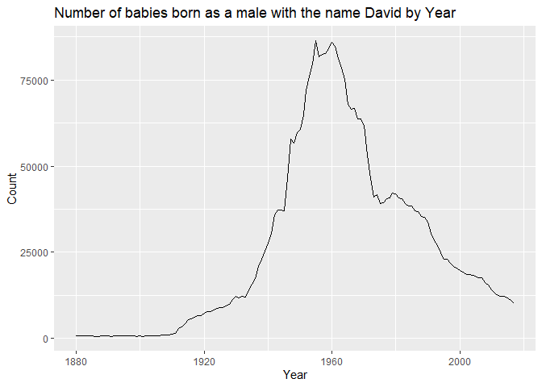

**Homework 2**
================

I wanted to investigate the popularity of the name “David” over time.

**Library installation packages (for class purposes)**

``` r
install.packages("tidyverse",repos = "http://cran.us.r-project.org")
```

    ## Installing package into 'C:/Users/dploh/Documents/R/win-library/4.1'
    ## (as 'lib' is unspecified)

    ## package 'tidyverse' successfully unpacked and MD5 sums checked
    ## 
    ## The downloaded binary packages are in
    ##  C:\Users\dploh\AppData\Local\Temp\Rtmp88JW7i\downloaded_packages

``` r
library(tidyverse)
```

    ## -- Attaching packages --------------------------------------- tidyverse 1.3.1 --

    ## v ggplot2 3.3.5     v purrr   0.3.4
    ## v tibble  3.1.4     v dplyr   1.0.7
    ## v tidyr   1.1.3     v stringr 1.4.0
    ## v readr   2.0.1     v forcats 0.5.1

    ## -- Conflicts ------------------------------------------ tidyverse_conflicts() --
    ## x dplyr::filter() masks stats::filter()
    ## x dplyr::lag()    masks stats::lag()

``` r
install.packages("babynames",repos = "http://cran.us.r-project.org")
```

    ## Installing package into 'C:/Users/dploh/Documents/R/win-library/4.1'
    ## (as 'lib' is unspecified)

    ## package 'babynames' successfully unpacked and MD5 sums checked
    ## 
    ## The downloaded binary packages are in
    ##  C:\Users\dploh\AppData\Local\Temp\Rtmp88JW7i\downloaded_packages

``` r
library("babynames")
library(dplyr)
library(ggplot2)
```

**Review data**

``` r
my_data<- filter(babynames, name=="David",sex=="M")
head(my_data)
```

    ## # A tibble: 6 x 5
    ##    year sex   name      n    prop
    ##   <dbl> <chr> <chr> <int>   <dbl>
    ## 1  1880 M     David   869 0.00734
    ## 2  1881 M     David   750 0.00693
    ## 3  1882 M     David   838 0.00687
    ## 4  1883 M     David   734 0.00653
    ## 5  1884 M     David   761 0.00620
    ## 6  1885 M     David   712 0.00614

**Plot**

``` r
   ggplot(data=my_data,aes(x = year, y = n)) +
   geom_line() + 
   labs(
        title = "Number of babies born as a male with the name David by Year", 
        x = "Year", 
        y = "Count")
```

<!-- -->

**Conclusion** I wanted to investigate the popularity of the name
“David” over time. The name “David” appeared to peak in the late 1950’s
and early 1960’s. It has declined into the 2000’s.
