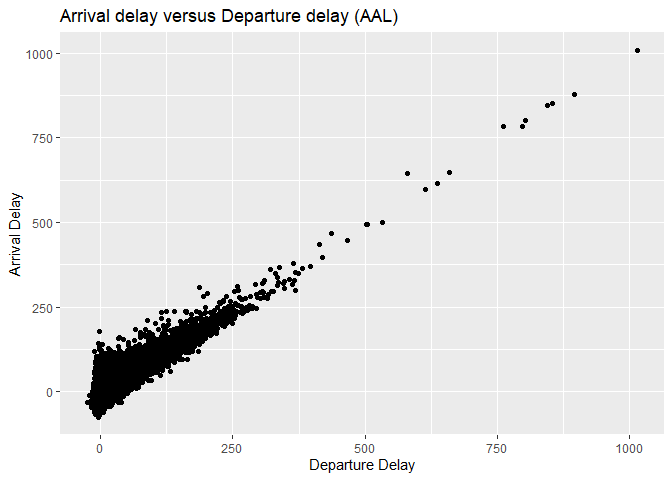

Homework 4, Plot Assignment (David)
================

##### Loading Libraries

``` r
# Loading libraries for the script, hide output
library(tidyverse)
```

##### Calculate the sum of 2 and 3 as follows:

``` r
# Assign variables
a <- 3
b <- 2
#Calculate sum
a+b
```

    ## [1] 5

``` r
#Calculate sum of 2 and 3 using sum function
sum(2,3)
```

    ## [1] 5

``` r
#Calculate sum of a and b using sum function
sum(a,b)
```

    ## [1] 5

##### Using the flights data frame, make a scatterplot of arrival delay versus departure delay, for only American Airlines flights

``` r
# Loading libraries for the script, hide output
library(nycflights13)
```

``` r
#Filter flights table for American Airlines
aal_flights <- filter(flights,carrier=="AA")
head(aal_flights)
```

    ## # A tibble: 6 x 19
    ##    year month   day dep_time sched_dep_time dep_delay arr_time sched_arr_time
    ##   <int> <int> <int>    <int>          <int>     <dbl>    <int>          <int>
    ## 1  2013     1     1      542            540         2      923            850
    ## 2  2013     1     1      558            600        -2      753            745
    ## 3  2013     1     1      559            600        -1      941            910
    ## 4  2013     1     1      606            610        -4      858            910
    ## 5  2013     1     1      623            610        13      920            915
    ## 6  2013     1     1      628            630        -2     1137           1140
    ## # ... with 11 more variables: arr_delay <dbl>, carrier <chr>, flight <int>,
    ## #   tailnum <chr>, origin <chr>, dest <chr>, air_time <dbl>, distance <dbl>,
    ## #   hour <dbl>, minute <dbl>, time_hour <dttm>

``` r
ggplot(data = aal_flights) +
  geom_point(mapping = aes(x = dep_delay, y = arr_delay)) +
  labs(title = "Arrival delay versus Departure delay (AAL)", x = "Departure Delay", y = "Arrival Delay")
```

    ## Warning: Removed 782 rows containing missing values (geom_point).

<!-- -->
