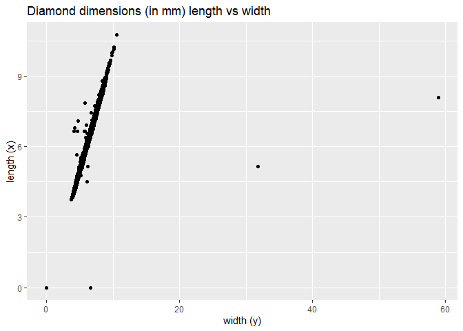
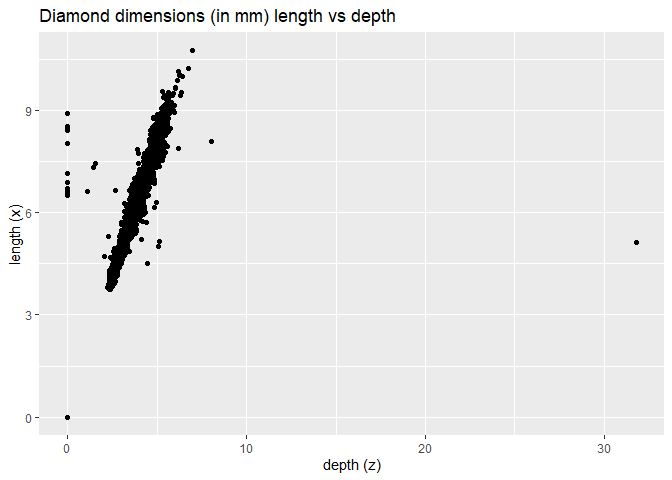
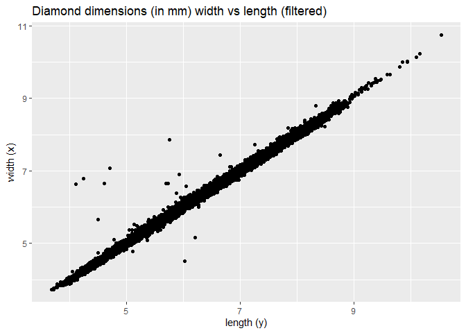
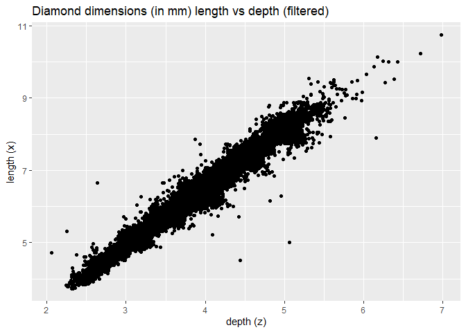

Homework 5, Diamonds Assignment (David)
================

##### Loading Libraries

``` r
# Loading libraries for the script, hide output
library(tidyverse)
```

##### 1) Print a data frame that contains the simple count of diamonds in each cut

``` r
#Group the dataset and then count each cut
diamonds %>%
  group_by(cut) %>%
  count()
```

    ## # A tibble: 5 x 2
    ## # Groups:   cut [5]
    ##   cut           n
    ##   <ord>     <int>
    ## 1 Fair       1610
    ## 2 Good       4906
    ## 3 Very Good 12082
    ## 4 Premium   13791
    ## 5 Ideal     21551

##### 2) Use dplyr functions to create a random subset (1% of total) of the diamonds dataset and check the results

``` r
diamonds_subset <-sample_frac(diamonds,0.01)
head(diamonds_subset)
```

    ## # A tibble: 6 x 10
    ##   carat cut       color clarity depth table price     x     y     z
    ##   <dbl> <ord>     <ord> <ord>   <dbl> <dbl> <int> <dbl> <dbl> <dbl>
    ## 1  0.31 Ideal     G     VS2      60.8    56   562  4.38  4.4   2.67
    ## 2  1.16 Ideal     H     SI1      60      60  5852  6.87  6.84  4.11
    ## 3  1.32 Ideal     F     SI1      61.6    56  7079  7.11  7.05  4.36
    ## 4  0.4  Ideal     G     SI1      62.3    54   741  4.74  4.77  2.96
    ## 5  0.32 Good      H     SI1      63.1    58   461  4.33  4.36  2.74
    ## 6  1.03 Very Good G     SI2      63.1    58  4060  6.41  6.37  4.03

##### 3) Calculate the average size of the 100 largest diamonds in each clarity category (using the diamonds subset).

##### Determine if there are 100 of each clarity category in the diamonds subset dataframe

``` r
diamonds_subset %>%
  group_by(clarity) %>%
  count()
```

    ## # A tibble: 8 x 2
    ## # Groups:   clarity [8]
    ##   clarity     n
    ##   <ord>   <int>
    ## 1 I1          6
    ## 2 SI2        78
    ## 3 SI1       138
    ## 4 VS2       123
    ## 5 VS1        86
    ## 6 VVS2       53
    ## 7 VVS1       41
    ## 8 IF         14

##### Since there are not 100 in each category, we will expand back to the original diamonds dataset

#### Determine if there are 100 in each clarity category in the original diamonds dataframe

``` r
diamonds %>%
  group_by(clarity) %>%
  count()
```

    ## # A tibble: 8 x 2
    ## # Groups:   clarity [8]
    ##   clarity     n
    ##   <ord>   <int>
    ## 1 I1        741
    ## 2 SI2      9194
    ## 3 SI1     13065
    ## 4 VS2     12258
    ## 5 VS1      8171
    ## 6 VVS2     5066
    ## 7 VVS1     3655
    ## 8 IF       1790

##### We now have determined that we have to use the original dataframe to obtain the 100 largest diamonds in each clarity category.

``` r
#Grab the 100 largest diamonds in each category
largest_diamonds <- diamonds %>%
  arrange(desc(carat)) %>%
  group_by(clarity) %>%
  slice(1:100)
largest_diamonds %>%
  group_by(clarity) %>%
  count()
```

    ## # A tibble: 8 x 2
    ## # Groups:   clarity [8]
    ##   clarity     n
    ##   <ord>   <int>
    ## 1 I1        100
    ## 2 SI2       100
    ## 3 SI1       100
    ## 4 VS2       100
    ## 5 VS1       100
    ## 6 VVS2      100
    ## 7 VVS1      100
    ## 8 IF        100

##### Calculate the average size of the largest diamond in each category

``` r
largest_diamonds %>%
  group_by(clarity) %>%
  summarise(mean(carat))
```

    ## # A tibble: 8 x 2
    ##   clarity `mean(carat)`
    ##   <ord>           <dbl>
    ## 1 I1               2.51
    ## 2 SI2              2.62
    ## 3 SI1              2.30
    ## 4 VS2              2.23
    ## 5 VS1              2.10
    ## 6 VVS2             1.66
    ## 7 VVS1             1.51
    ## 8 IF               1.40

##### 4) Make two scatter plots, length(x) vs width(y) and length(x) vs depth(z). The naming on the assignment suggests to plot length on the y-axis and width,depth on the x-axis.

``` r
ggplot(data = diamonds) +
  geom_point(mapping = aes(x = y, y = x)) +
  labs(title = "Diamond dimensions (in mm) length vs width", x = "width (y)", y = "length (x)")
```

<!-- -->

``` r
ggplot(data = diamonds) +
  geom_point(mapping = aes(x = z, y = x)) +
  labs(title = "Diamond dimensions (in mm) length vs depth", x = "depth (z)", y = "length (x)")
```

<!-- -->

##### The plots show that there are a few outliers. We will filter the outliers out of the dataset.We will plot the results

``` r
diamonds_filtered <-
  diamonds %>%
  filter(x > 3 & y < 20 & z>2 & z < 10)
head(diamonds_filtered)
```

    ## # A tibble: 6 x 10
    ##   carat cut       color clarity depth table price     x     y     z
    ##   <dbl> <ord>     <ord> <ord>   <dbl> <dbl> <int> <dbl> <dbl> <dbl>
    ## 1  0.23 Ideal     E     SI2      61.5    55   326  3.95  3.98  2.43
    ## 2  0.21 Premium   E     SI1      59.8    61   326  3.89  3.84  2.31
    ## 3  0.23 Good      E     VS1      56.9    65   327  4.05  4.07  2.31
    ## 4  0.29 Premium   I     VS2      62.4    58   334  4.2   4.23  2.63
    ## 5  0.31 Good      J     SI2      63.3    58   335  4.34  4.35  2.75
    ## 6  0.24 Very Good J     VVS2     62.8    57   336  3.94  3.96  2.48

``` r
##### Plot the filtered diamond results
```

``` r
ggplot(data = diamonds_filtered) +
  geom_point(mapping = aes(x = y, y = x)) +
  labs(title = "Diamond dimensions (in mm) length vs width (filtered)", x = "width (y)", y = "length (x)")
```

<!-- -->

``` r
ggplot(data = diamonds_filtered) +
  geom_point(mapping = aes(x = z, y = x)) +
  labs(title = "Diamond dimensions (in mm) length vs depth (filtered)", x = "depth (z)", y = "length (x)")
```

<!-- -->
