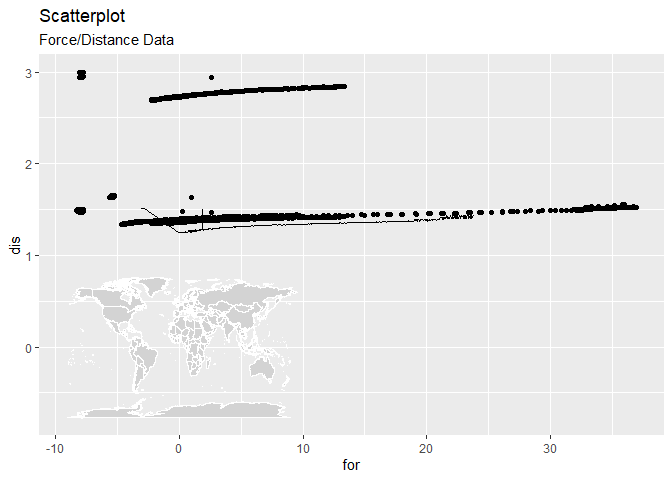
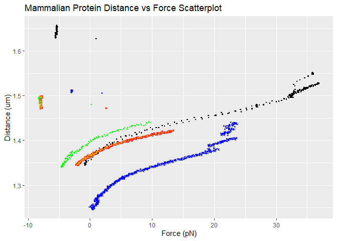

Homework 7, Badplot Assignment (David)
================

## Overview

The purpose of this assignment is to plot the data in the worse possible
way, preferably using your own data. The data below is from a
biophysical experiment that measures the force and distance as DNA is
stretched. The plot shows that an increasing amount of force is needed
to stretch the DNA.

##### Loading Libraries

``` r
# Loading libraries for the script, hide output
library(tidyverse)
require(maps)
```

##### Loading Data

``` r
f1 <- read.csv("hw_7_files/f1.csv")
f2 <- read.csv("hw_7_files/f2.csv")
f3 <- read.csv("hw_7_files/f3.csv")
g1 <- read.csv("hw_7_files/g1.csv")
g2 <- read.csv("hw_7_files/f2.csv")
world_map <- map_data("world")
```

##### Here is a quick view of the data. All 5 datasets are similar in nature.

``` r
head(f1)
```

    ##   X     Force Distance
    ## 1 0 0.8682935 1.269614
    ## 2 1 0.8312877 1.270493
    ## 3 2 1.0983828 1.268227
    ## 4 3 0.8279333 1.269839
    ## 5 4 1.1566863 1.267555
    ## 6 5 1.3696464 1.267003

## Bad Plot with Data

The proteins studied in this experiment are mammalian proteins and found
throughout the world.

``` r
ggplot() +
  geom_polygon(data=world_map, aes(x = long/20, y = lat/110, group = group),fill="lightgray", colour = "white") +
  geom_line(data=f1, mapping = aes(x = Force, y = Distance))+
  geom_point(data=f2, mapping = aes(x = Force, y = Distance))+
  geom_point(data=f3, mapping = aes(x = Force, y = Distance))+
  geom_point(data=g1, mapping = aes(x = Force, y = Distance))+
  geom_point(data=g2, mapping = aes(x = Force, y = Distance*2))+
  labs(  x = "for", 
         y = "dis",
        title = "Scatterplot", 
        subtitle = "Force/Distance Data")
```

<!-- -->

This plot is bad for the following reasons:

-   A single color was used for each set of experiments (Wilke 4)

-   The same shape was used for all of the lines so you can not
    distinguish the different datasets (Wilke 2)

-   The axis are not labeled properly

-   One of the lines has a multiplier with it in an effort to separate
    it from the rest. (Tufte 76, graphical integrity)

-   The data is being plotted on a world map for show but it is not
    related and adds unnecessary clutter (Tufte 13 Graphical excellence)

## Better Plot with Data

This scatterplot uses different colors and shapes for the lines. It also
removes the picture of the world which was confusing to readers of the
original bad plot design.

``` r
ggplot() +
  geom_point(data=f1, aes(x = Force, y = Distance),color="blue", shape=13,size=0.5)+
  geom_point(data=f2, mapping = aes(x = Force, y = Distance),color="red",shape=14,size=0.5)+
  geom_point(data=f3, mapping = aes(x = Force, y = Distance),color="black",shape=15,size=0.5)+
  geom_point(data=g1, mapping = aes(x = Force, y = Distance),color="green",shape=16,size=0.5)+
  geom_point(data=g2, mapping = aes(x = Force, y = Distance),color="orange",shape=17,size=0.5)+
  labs(  x = "Force (pN)", 
         y = "Distance (um)",
        title = "Mammalian Protein Distance vs Force Scatterplot")+
  theme(legend.title = element_blank(),legend.position="right")
```

<!-- -->
