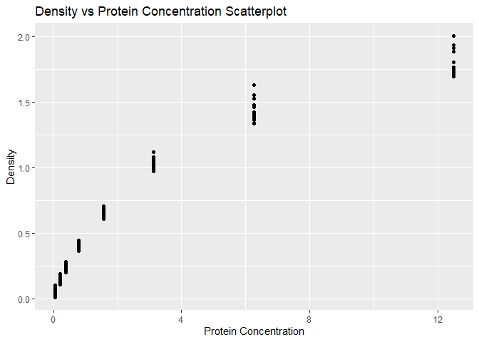
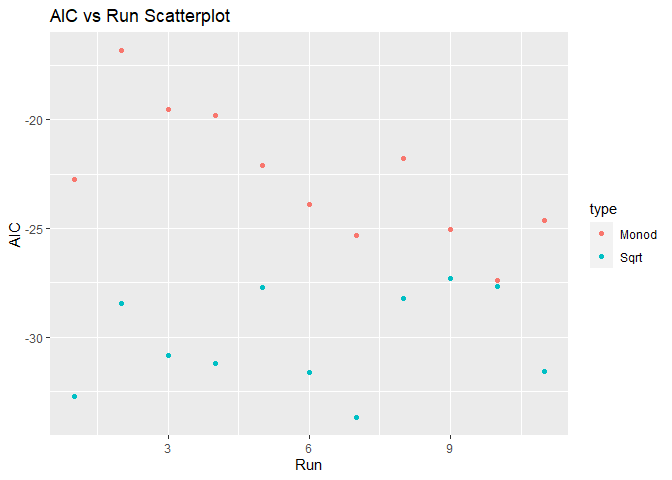

Homework 8, Nonlinear (David)
================

##### Loading Libraries

``` r
# Loading libraries for the script, hide output
library(tidyverse)
library(nls2)
library(broom)
```

## Problem 1

##### Using the diamonds data set, make a data frame that shows the slope of the relationship of price as a function of weight (carat) for each unique color, in decreasing order of slope.

``` r
# y = price
# x = carat
# lm model is y ~ x
dia_list <- diamonds %>%
  split(.$color) %>%
  map(~lm(price ~ carat,data=.)) %>%
  map(coefficients) %>%
  map_dbl("carat")

dia_list_temp <- dia_list[order(desc(dia_list))]
colnames <- c("Color","Price/Carat Slope")
dia_df <- as.data.frame(dia_list_temp)
names(dia_df)[1] <- "Price/Carat Slope"
knitr::kable(dia_df)
```

|     | Price/Carat Slope |
|:----|------------------:|
| F   |          8676.658 |
| G   |          8525.346 |
| D   |          8408.353 |
| E   |          8296.213 |
| I   |          7761.041 |
| H   |          7619.098 |
| J   |          7094.192 |

## Problem 2

##### The DNase dataset in the datasets package (which automatically loads when you load R) has examples of ELISA band optical density as a function of protein concentration, for 12 different runs. These relationships are clearly nonlinear (please plot density as a function of conc to see for yourself!).

``` r
# x = conc
# y = density
ggplot() +
  geom_point(data=DNase, aes(x = conc, y = density)) +
  labs(  x = "Protein Concentration", 
         y = "Density",
        title = "Density vs Protein Concentration Scatterplot")
```

<!-- -->

##### For instance, to fit the model above to the full data set, we could do as follows for the Square Root Model

``` r
# Square Root Model
# x = conc
# y = density
nls_mod <- formula(density ~ beta_1 * sqrt(conc) + beta_0)

#Testing individual SQRT non linear function 
nested <- DNase %>%
  nest(data = -Run) %>%
  mutate(
    fit = map(data, ~ nls2(nls_mod,data=.,
                          start = list(beta_1 = 0.5, beta_0 = 0.1))),
    glanced = map(fit,glance)
  ) 

nested %>%
  unnest(glanced)
```

    ## # A tibble: 11 x 12
    ##    Run   data          fit     sigma isConv   finTol logLik   AIC   BIC deviance
    ##    <ord> <list>        <list>  <dbl> <lgl>     <dbl>  <dbl> <dbl> <dbl>    <dbl>
    ##  1 1     <nfnGroupedD~ <nls>  0.0771 TRUE    6.90e-8   19.4 -32.7 -30.4   0.0833
    ##  2 2     <nfnGroupedD~ <nls>  0.0881 TRUE    4.82e-8   17.2 -28.5 -26.1   0.109 
    ##  3 3     <nfnGroupedD~ <nls>  0.0817 TRUE    1.07e-7   18.4 -30.9 -28.6   0.0935
    ##  4 4     <nfnGroupedD~ <nls>  0.0809 TRUE    5.99e-8   18.6 -31.2 -28.9   0.0915
    ##  5 5     <nfnGroupedD~ <nls>  0.0902 TRUE    6.04e-8   16.9 -27.7 -25.4   0.114 
    ##  6 6     <nfnGroupedD~ <nls>  0.0798 TRUE    7.55e-8   18.8 -31.6 -29.3   0.0891
    ##  7 7     <nfnGroupedD~ <nls>  0.0748 TRUE    1.53e-7   19.8 -33.7 -31.4   0.0784
    ##  8 8     <nfnGroupedD~ <nls>  0.0888 TRUE    4.84e-8   17.1 -28.2 -25.9   0.110 
    ##  9 9     <nfnGroupedD~ <nls>  0.0914 TRUE    3.74e-8   16.7 -27.3 -25.0   0.117 
    ## 10 10    <nfnGroupedD~ <nls>  0.0904 TRUE    1.24e-7   16.8 -27.7 -25.3   0.114 
    ## 11 11    <nfnGroupedD~ <nls>  0.0799 TRUE    3.88e-8   18.8 -31.6 -29.3   0.0895
    ## # ... with 2 more variables: df.residual <int>, nobs <int>

##### Fitting to the monod model

``` r
monod_formula <- formula(density ~ (conc * max(density))/(conc + k))

nested <- DNase %>%
  nest(data = -Run) %>%
  mutate(
    fit = map(data, ~ nls2(monod_formula, 
                    data = ., 
                    start = list(k = 0.5))),
    glanced = map(fit,glance)
    
  ) 

nested %>%
  unnest(glanced)
```

    ## # A tibble: 11 x 12
    ##    Run   data           fit    sigma isConv   finTol logLik   AIC   BIC deviance
    ##    <ord> <list>         <lis>  <dbl> <lgl>     <dbl>  <dbl> <dbl> <dbl>    <dbl>
    ##  1 1     <nfnGroupedDa~ <nls> 0.108  TRUE    3.10e-6   13.4 -22.8 -21.2    0.176
    ##  2 2     <nfnGroupedDa~ <nls> 0.130  TRUE    5.61e-6   10.4 -16.8 -15.3    0.255
    ##  3 3     <nfnGroupedDa~ <nls> 0.120  TRUE    6.61e-6   11.8 -19.5 -18.0    0.215
    ##  4 4     <nfnGroupedDa~ <nls> 0.119  TRUE    5.54e-6   11.9 -19.8 -18.3    0.212
    ##  5 5     <nfnGroupedDa~ <nls> 0.111  TRUE    3.50e-6   13.1 -22.1 -20.6    0.183
    ##  6 6     <nfnGroupedDa~ <nls> 0.104  TRUE    4.77e-6   14.0 -23.9 -22.4    0.164
    ##  7 7     <nfnGroupedDa~ <nls> 0.100  TRUE    3.07e-6   14.7 -25.3 -23.8    0.150
    ##  8 8     <nfnGroupedDa~ <nls> 0.112  TRUE    2.78e-6   12.9 -21.8 -20.2    0.187
    ##  9 9     <nfnGroupedDa~ <nls> 0.101  TRUE    1.56e-6   14.5 -25.1 -23.5    0.152
    ## 10 10    <nfnGroupedDa~ <nls> 0.0937 TRUE    6.25e-6   15.7 -27.4 -25.9    0.132
    ## 11 11    <nfnGroupedDa~ <nls> 0.102  TRUE    8.63e-6   14.3 -24.6 -23.1    0.157
    ## # ... with 2 more variables: df.residual <int>, nobs <int>

## Combine and Plot models

``` r
sqrt_formula <- formula(density ~ beta_1 * sqrt(conc) + beta_0)
monod_formula <- formula(density ~ (conc * max(density))/(conc + k))

combined <- DNase %>%
  nest(data = -Run) %>%
  mutate(
    monod_fit = map(data, ~ nls2(monod_formula, 
                    data = ., 
                    start = list(k = 0.5))),
    monod_glanced = map(monod_fit,glance),
    sqrt_fit = map(data, ~ nls2(sqrt_formula,data=.,
                          start = list(beta_1 = 0.5, beta_0 = 0.1))),
    sqrt_glanced = map(sqrt_fit,glance)
  ) 

temp <- combined %>%
  unnest(monod_glanced)
monod_AIC <- temp$AIC
temp <- combined %>%
  unnest(sqrt_glanced)
sqrt_AIC <- temp$AIC

monod_df <- data.frame(run=1:11, type = "Monod", AIC=monod_AIC)
sqrt_df <-  data.frame(run=1:11, type = "Sqrt", AIC=sqrt_AIC)
model_df <- rbind(monod_df,sqrt_df)

# x = Run
# y = AIC
ggplot(data=model_df, aes(x = run, y = AIC)) +
  geom_point(aes(color=type)) +
  labs(  x = "Run", 
         y = "AIC",
        title = "AIC vs Run Scatterplot")
```

<!-- -->

## Conclusion

The purpose of the assignment was to understand whether the Monod or
Sqrt function would provide a better fit for the data. The figure shows
that the Sqrt formula has more negative AIC values. AIC values are not
judged on absolute values so therefore since the Sqrt is more negative
than Monod, it has a better fit.
